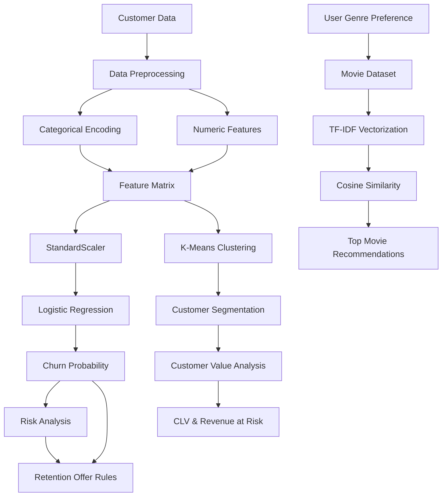

# Netflix Customer Churn Prediction, CLV & Personalized Movie Recommendation

An end-to-end **Machine Learning and Flask web application** that predicts customer churn, estimates customer lifetime value, identifies high-risk customers, provides retention offers, performs customer segmentation, and recommends movies based on the user's preferred genre.

---

## 📌 Project Overview

Customer retention is an important challenge for subscription-based streaming platforms.

This project uses **Machine Learning, Customer Analytics, and a Flask web application** to analyze customer behavior and provide actionable insights.

The application has two main sides:

### 👤 User Side

* User registration and login
* Customer profile management
* Churn probability prediction
* Churn risk explanation
* Personalized movie recommendations
* Retention offer based on customer risk and value
* Profile and subscription information

### 👨‍💼 Admin Side

* Customer churn analytics
* Customer Lifetime Value (CLV)
* Revenue at Risk
* High-risk customer identification
* Customer segmentation using K-Means
* Retention campaign analysis
* Business-level customer insights

---

## 🎯 Project Objectives

The main objectives of this project are:

1. Predict the probability of customer churn.
2. Identify customers who are at high risk of leaving.
3. Estimate Customer Lifetime Value (CLV).
4. Calculate potential Revenue at Risk.
5. Segment customers based on their behavior and value.
6. Generate retention offers using business rules.
7. Recommend movies based on the customer's preferred genre.
8. Provide all functionality through an interactive Flask web application.

---

# 🧠 Machine Learning Architecture



---

# 🤖 Machine Learning Models

## 1. Logistic Regression — Churn Prediction

Logistic Regression is used to predict the probability that a customer will churn.

The model considers customer attributes such as:

* Age
* Gender
* Region
* Subscription Type
* Monthly Charges
* Tenure
* Number of Profiles
* Device
* Payment Method
* Genre Preference
* Average Watch Hours
* Last Login Days
* Support Tickets
* Active Devices
* Kids Profile
* AutoPay
* Discount Usage

The output is a probability between `0` and `1`.

Example:

```text
Churn Probability = 0.78
```

This can be displayed as:

```text
78% Churn Risk
```

A higher probability indicates a higher likelihood of customer churn.

---

## 2. K-Means — Customer Segmentation

K-Means clustering is used to divide customers into different groups based on their characteristics and behavior.

The project uses:

```text
Number of Clusters = 4
```

The clusters are interpreted using customer characteristics such as:

* Monthly charges
* Tenure
* Usage
* Customer value
* Churn risk

This helps the business understand different types of customers and design suitable retention strategies.

---

# 💰 Customer Lifetime Value (CLV)

Customer Lifetime Value estimates the expected value of a customer over a defined period.

The project calculates a 12-month CLV.

Conceptually:

```text
12-Month CLV ≈ Monthly Value × Expected Remaining Lifetime
```

CLV helps the business identify customers who are financially valuable.

---

# 📉 Revenue at Risk

Revenue at Risk estimates the potential revenue that could be lost if customers with a high probability of churn leave the platform.

Conceptually:

```text
Revenue at Risk ≈ Customer Value × Churn Probability
```

This metric is primarily used on the **Admin Dashboard** for business analysis.

---

# 🎁 Retention Offer Engine

The project uses a **rule-based retention strategy** after the churn prediction.

The Machine Learning model predicts:

```text
Churn Probability
```

The retention system then combines:

```text
Churn Risk + Customer Value
```

to determine an appropriate offer.

### Retention Segments

| Segment          | Condition               | Offer                |
| ---------------- | ----------------------- | -------------------- |
| Rescue Now       | High value + High risk  | 25% off for 3 months |
| Protect & Reward | High value + Low risk   | Loyalty benefits     |
| Low-Cost Nudge   | Lower value + High risk | 10% off for 2 months |
| Maintain         | Lower value + Low risk  | No discount          |

### Important

The Logistic Regression model **does not predict the discount**.

Instead:

```text
Logistic Regression
        ↓
Churn Probability
        ↓
Business Rules
        ↓
Retention Offer
```

This keeps the ML prediction separate from the business decision logic.

---

# 🎬 Personalized Movie Recommendation System

The project also contains a **genre-aware content-based movie recommendation system**.

The recommendation system does not require watch history.

Instead, it uses the user's:

```text
Genre Preference
```

### Recommendation Pipeline

```text
User Genre Preference
        ↓
Movie Dataset
        ↓
Genre Filtering
        ↓
TF-IDF Vectorization
        ↓
Cosine Similarity
        ↓
Movie Rating
        ↓
Top 5 Recommendations
```

---

## 🔍 Recommendation Technique

The system combines:

* Genres
* Keywords
* Movie Overview
* Movie Rating

TF-IDF is used to convert movie text into numerical vectors.

Cosine similarity is then used to measure how similar the user's preferred genre is to the available movies.

The recommendation score combines:

```text
Content Similarity
+
Movie Rating
```

The system returns the top 5 movies.

---

## 🆕 New User Recommendation Flow

A new user can receive recommendations immediately after registration.

```text
Register
   ↓
Select Preferred Genre
   ↓
Genre Saved in Database
   ↓
Recommendation Engine
   ↓
Top 5 Movies
```

No watch history is required.

This is a **content-based recommendation system**, not a full Netflix-style collaborative filtering system.

---

# 🗃️ Dataset

The main customer dataset contains approximately:

```text
10,000 customer records
```

The customer dataset contains information related to:

* Customer demographics
* Subscription
* Usage
* Payment
* Engagement
* Support activity
* Churn behavior

The project also contains a curated movie dataset:

```text
recommendation/movies.csv
```

Movie dataset fields include:

```text
movie_id
title
genres
overview
keywords
rating
```

---

# 🛢️ Database

The application uses **MySQL** for storing user and application data.

## Users Table

Important fields include:

```text
id
name
email
password
age
gender
region
subscription_type
monthly_charges
tenure_months
number_of_profiles
device
payment_method
genre_preference
avg_watch_hours_per_week
last_login_days
support_tickets_raised
num_devices_active
has_kids_pr
```
